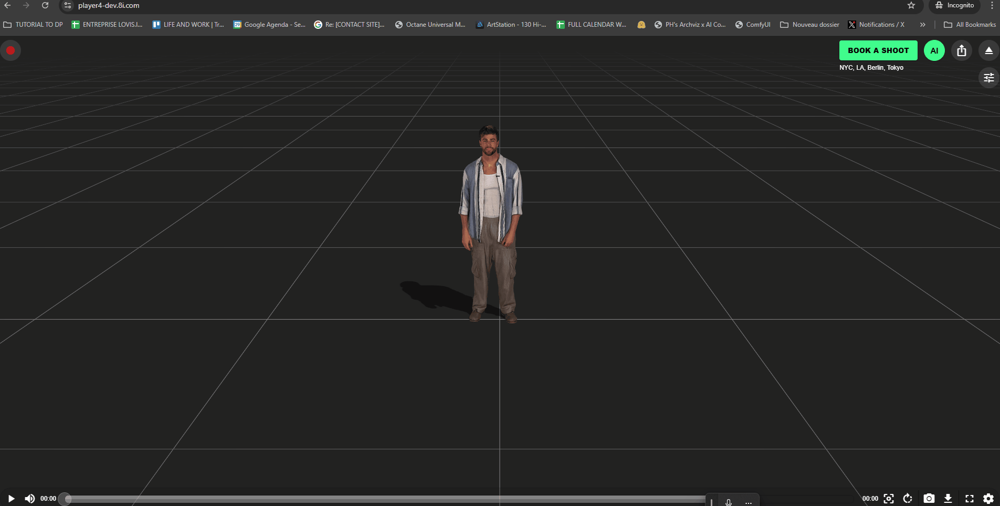
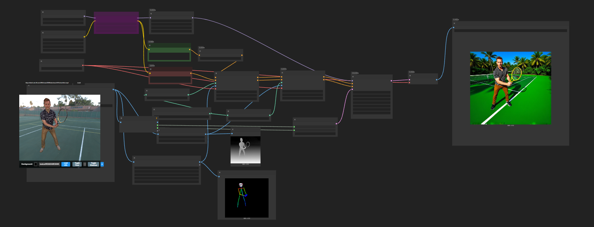
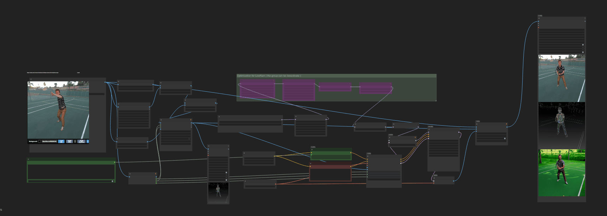
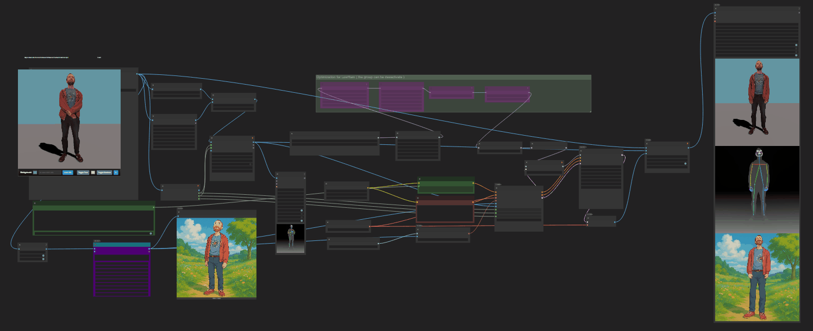

# ✨ ComfyUI-8iPlayer ✨

Developed for [**Kartel.ai**](https://Kartel.ai) by [Lovis Odin](https://x.com/OdinLovis)

<a href="https://Kartel.IAI"></a>

A custom node for ComfyUI providing an interactive 3D viewer for 8i volumetric videos (MPD format), allowing frame capture and integration into workflows.


---

## 🚀 Key Features

*   **🖼️ Interactive 8i MPD Viewer:** Load and view 8i videos via URL.
*   **🎞️ Frame Sequence Capture:** Grab frames from the video timeline.
*   **⏯️ Playback Controls:** Basic play/pause functionality.
*   **🎨 Customizable Background:** Use solid colors or HDR environment maps (via URL).
*   **🧊 Toggleable Floor:** Add an optional ground plane.
*   **☀️ Toggleable Shadows:** Cast shadows onto the floor (requires floor).
*   **📦 Outputs:** Provides captured frames as an `IMAGE` batch.

---

## 🙏 Foundation & Core Credits

This node heavily utilizes and adapts code from the excellent [**comfyui-mixlab-nodes**](https://github.com/shadowcz007/comfyui-mixlab-nodes) project by shadowcz007, particularly for the web viewer interface and the underlying structure connecting the frontend controls to the backend execution.

---

## 🛠️ Installation

1.  Navigate to your ComfyUI `custom_nodes` directory:
    ```bash
    cd ComfyUI/custom_nodes/
    ```
2.  Clone the repository (from Kartel.IAI):
    ```bash
    git clone https://github.com/Kartel-IAI/ComfyUI-8iPlayer.git ComfyUI-8iPlayer
    ```
3.  Install the required dependencies:
    ```bash
    cd ComfyUI-8iPlayer
    pip install -r requirements.txt
    ```
4.  Restart ComfyUI. ✅

---

## 🎮 How to Use

1.  Add the **"8i - 3Dplayer"** node to your workflow.
2.  Paste the 8i `.mpd` manifest URL into the node's panel.
    *   You can obtain the MPD URL directly from the official [8i Web Player](https://player4-dev.8i.com/). Click the dedicated button on the player interface to copy the manifest URL.
    *   
3.  Click **"Load MPD"**. The hologram should appear.
4.  Use the **panel controls** to adjust:
    *   Background (Color Picker / HDR URL + Load Button)
        *   ***Example HDR URLs:*** You can try these links:
            ```
            https://lovis.io/RESSOURCE/HDR/01.hdr
            https://lovis.io/RESSOURCE/HDR/02.hdr
            https://lovis.io/RESSOURCE/HDR/03.hdr
            https://lovis.io/RESSOURCE/HDR/04.hdr
            https://lovis.io/RESSOURCE/HDR/05.hdr
            https://lovis.io/RESSOURCE/HDR/06.hdr
            ```
    *   Floor (Toggle Button / Color Picker)
    *   Shadows (Toggle Button)
    *   Playback (Play/Pause Button)
5.  Use the **mouse** for camera control:
    *   Left-drag: Orbit
    *   Right-drag: Pan
    *   Scroll: Zoom
6.  Set the desired **`frame_count`** on the node input.
7.  Connect the `IMAGE` output to the next node (e.g., VAE Encode, Preview Image).
8.  Queue Prompt! ▶️ (Adjusting the camera view also triggers execution on the next run).

---

## ⚙️ Node Details

**Node: `8i - 3Dplayer` (`3DImage`)**

*   **Inputs:**
    *   `frame_count` (INT): Number of frames to capture (Default: 24, Min: 1, Max: 120).
    *   `upload` (Internal): Handles data from the web UI.
    *   `_camera_timestamp` (Internal): Triggers re-execution on camera change.
*   **Outputs:**
    *   `IMAGE` (IMAGE Batch): The sequence of captured frames.

---

## 🧪 Example Workflows

Download the example workflow JSON files from the [`workflow_examples`](./workflow_examples) directory.

*   **FLUX Enhancement:** Takes captured frames and uses the FLUX model for realism.
    *   Workflow File: [`workflow-8i-flux-v01.json`](./workflow_examples/workflow-8i-flux-v01.json)
    *   

*   **Wan 1.3b Basic Video:** Uses captured frames with the Wan 1.3b model.
    *   Workflow File: [`workflow-8i-wan-fun-1.3b-v01.json`](./workflow_examples/workflow-8i-wan-fun-1.3b-v01.json)
    *   

*   **Wan 1.3b + ChatGPT:** Extends the Wan workflow with ChatGPT for prompt generation or other tasks.
    *   Workflow File: [`workflow-8i-wan-fun-1.3b-ChatGpt-v01.json`](./workflow_examples/workflow-8i-wan-fun-1.3b-ChatGpt-v01.json)
    *   

---

## 🤔 Troubleshooting

*   **Load/Playback Fails:**
    *   Verify MPD/HDR URL is correct and accessible (check CORS).
    *   Check browser console (F12) for errors.
    *   Try clicking "Load MPD" again.
*   **Viewer Black:** Check console; ensure WebGL is enabled in your browser.
*   **Performance:** High `frame_count`, large HDRs, and shadows can be demanding.

---

## 💻 Technical Details

*   **Frontend:** Built with Three.js.
*   **MPD Playback:** Uses the 8i DashPlayer library.
*   **Camera:** Three.js OrbitControls.
*   **HDR Loading:** Three.js RGBELoader.

---

## 🤝 Contributing

Pull requests are welcome! For major changes, please open an issue first to discuss.

---

## 🔮 Future Enhancements

We plan to add more features, including:

*   **🎥 Advanced Camera Controls:** More options for defining camera movements and paths.
*   **🧩 Enhanced Customization:** Support for adding multiple characters/holograms, importing custom environments or objects (e.g., GLB files).

---

## 👤 Author

Originally created by [**Lovis Odin**](https://x.com/OdinLovis).

---

## 📜 License

[MIT License](LICENSE)

---

## 🙏 Acknowledgements

*   Built for the amazing **ComfyUI** platform.
*   Uses **Three.js**, **8i DashPlayer**, **RGBELoader**.
*   Gratitude to the developers of the libraries mentioned above.

---

## 🆘 Support

Please report issues via the GitHub Issues page for this repository.